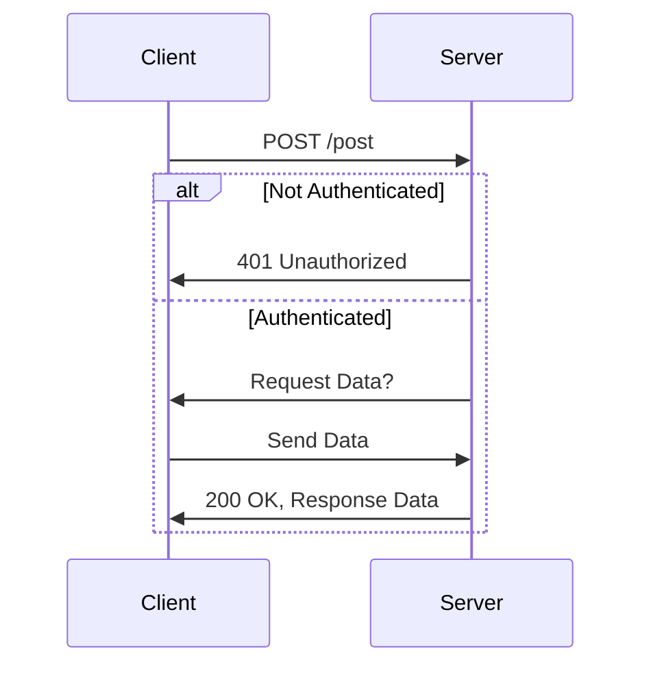

# My Project Name

Writing down Markdown examples here.

This project implements a simple HTTP server with a protected POST endpoint. Users must be authenticated to access the endpoint.

## Endpoint Description

### POST /post

This endpoint allows authenticated users to post data to the server. The following sequence diagram illustrates the interaction between the client and the server for this endpoint.

You could explain your project with diagrams in [Mermaid](https://github.blog/2022-02-14-include-diagrams-markdown-files-mermaid/). For example, the following "mermaid" block will render the diagram below.

````md

````


## Installation

You can install the server by following the instructions below.

In the following example, I use `sh` for highlighting syntax.

````md
```sh
git clone https://github.com/your-username/your-project.git
cd your-project
npm install
npm start
```
````

```sh
git clone https://github.com/your-username/your-project.git
cd your-project
npm install
npm start
```

## Testing

Run the tests with the following command:

```sh
npm test
```

## Run a script in `package.json`

### Example

```sh
npm run prettier
```

```sh
# Pro-tip: Adding alias nr="npm run" is handy!
nr prettier
```

## Tips

Writing Markdown is not straightforward. In VSCode, Control+Shift+P to open the command pallet. Then search "Markdown Open Preview". This preview window is **really** helpful.

## Notes for future development

* Microservice package.json
** has a "bin" field; points "node-app" to `./dist/index.cjs` file we build.
* Microservice CI/CD
** This is a much more involved process. It will need to run in Azure DevOps.
